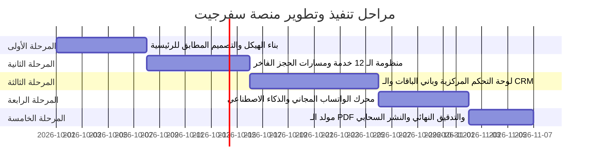

# ✈️ وثيقة العمل التنفيذية والمواصفات الفنية | منصة سفرجيت للسفر والسياحة
### **SafarJet - Travel & Tourism Platform Blueprint**
> **شعار البراند:** "العالم أقرب"  
> **نوع المشروع:** منصة سياحية كبرى متكاملة (Luxury Travel Agency & Digital Concierge)  
> **البنية السحابية:** Google Firebase + Node.js Baileys WhatsApp Engine + AI LLM  
> **تاريخ الإصدار:** سبتمبر 2026 | **الحالة:** معتمدة وبدء التنفيذ الفعلي

---

## 📌 الفهرس التنفيذي للمشروع
1. [القواعد الهندسية الصارمة للمشروع (Strict Engineering Rules)](#1-القواعد-الهندسية-الصارمة-للمشروع-strict-engineering-rules)
2. [الملخص التنفيذي وأهداف المنصة](#2-الملخص-التنفيذي-وأهداف-المنصة)
3. [الهوية البصرية والمظهر المعتمد](#3-الهوية-البصرية-والمظهر-المعتمد)
4. [تجربة العميل وفلسفة الحجز الفاخر](#4-تجربة-العميل-وفلسفة-الحجز-الفاخر)
5. [هندسة الواجهة الرئيسية (محاكاة التصور)](#5-هندسة-الواجهة-الرئيسية-محاكاة-التصور)
6. [شبكة الخدمات الـ 12 ومساراتها التخصصية](#6-شبكة-الخدمات-الـ-12-ومساراتها-التخصصية)
7. [وكيل الذكاء الاصطناعي وبوت الواتساب المجاني](#7-وكيل-الذكاء-الاصطناعي-وبوت-الواتساب-المجاني)
8. [لوحة التحكم المركزية للموظفين (SafarJet OS)](#8-لوحة-التحكم-المركزية-للموظفين-safarjet-os)
9. [القيمة المضافة للمشروع (قبل وبعد المنصة)](#9-القيمة-المضافة-للمشروع-قبل-وبعد-المنصة)
10. [البنية التقنية وقواعد بيانات Firebase](#10-البنية-التقنية-وقواعد-بيانات-firebase)
11. [خارطة الطريق ومراحل تسليم المشروع](#11-خارطة-الطريق-ومراحل-تسليم-المشروع)

---

## 1. القواعد الهندسية الصارمة للمشروع (Strict Engineering Rules)
لضمان أعلى درجات الأمان البرمجي، وسهولة التعديل المستقبلي دون تخريب أو تعارض:

1. **قاعدة الملفات الصغيرة المستقلة (Atomic Components):**
   - كل قسم، كل بطاقة، وكل تبويب بحث في ملف صغير ومستقل تماماً (بمعدل 30 - 80 سطراً لكل ملف).
   - ممنوع منعاً باتاً دمج أقسام مختلفة في ملف واحد؛ تعديل أي قسم يتم في ملفه الخاص فقط دون لمس بقية الموقع.
2. **قاعدة تحسين وضغط الصور التلقائي (Image Compression & WebP):**
   - تحويل وضغط جميع الصور بصيغ `WebP/AVIF` لتقليل الحجم بنسبة 80% مع الحفاظ على أعلى جودة.
   - تفعيل التحميل الكسول (Lazy Loading) لضمان فتح الصفحة في أجزاء من الثانية.
3. **قاعدة فصل البيانات والنصوص عن الأكواد (Separation of Data):**
   - كل أرقام الهواتف، الأسعار، الحسابات، والنصوص تدار من ملفات إعدادات مستقلة (`constants/`) لتعديلها بضغطة زر واحدة.
4. **قاعدة الجوال أولاً (Mobile-First Architecture):**
   - كل عنصر يُبنى ليناسب التصفح بيد واحدة وشاشات اللمس (Thumb-Friendly)، مع أزرار واضحة وقوائم سفلية ناعمة.
5. **قاعدة بطاقات المشاركة الفاخرة (OpenGraph Preview):**
   - عند مشاركة أي رابط على الواتساب أو تويتر، تظهر بطاقة فاخرة بصورة الوجهة السياحية وشعار "سفرجيت - العالم أقرب".
6. **قاعدة التحميل الذكي وعدم الانهيار (Skeleton Loaders):**
   - استخدام هياكل تحميل متحركة وناعمة عند الاتصال البطيء، مع حماية تامة ضد الشاشات البيضاء أو الأخطاء الصامتة.

---

## 2. الملخص التنفيذي وأهداف المنصة
يهدف مشروع **"سفرجيت"** إلى إطلاق منصة سفر وسياحة رائدة تنافس كبرى منصات المنطقة، لا تقتصر على كونها موقعاً إلكترونياً، بل تعمل كـ **نظام تشغيل رقمي متكامل للوكالة (Travel Agency Operating System)**.

### 🎯 الأهداف الاستراتيجية:
* **إلغاء فكرة المتاجر التقليدية (No Cart):** استبدال عربة التسوق بمسار حجز واستشارة فاخر ومخصص (VIP Journey).
* **أتمتة المبيعات بالذكاء الاصطناعي:** وكيل رقمي ذكي باللغتين العربية والإنجليزية يفهم رغبات العميل ويرشح الرحلات المناسبة فوراً.
* **واتساب آلي مجاني 100%:** تشغيل رقم الوكالة الرسمي لخدمة العملاء على مدار 24 ساعة دون أي تكاليف اشتراكات شهرية أو رسوم للرسائل.
* **تمكين فريق العمل (No-Code Control):** لوحة تحكم مركزية تسمح لأي موظف بإدارة كل محتوى المنصة، توليد عروض الأسعار كملفات PDF بضغطة زر، واستقبال إشعارات تفاعلية بنغمات مميزة.

---

## 3. الهوية البصرية والمظهر المعتمد
تم استلهام الهوية البصرية بدقة لتعكس الرقي والموثوقية المطلوبة في قطاع الطيران والسياحة الفاخرة:

| العنصر | القيمة / الكود اللوني | دلالة الاستخدام |
|---|---|---|
| **الكحلي الملكي (Deep Navy)** | `#0A2240` / `#061528` | اللون الأساسي (الهيدر، الفوتر، العناوين الرسمية، والبطاقات الفاخرة) |
| **السماوي الساطع (Aero Cyan)** | `#00A3E0` / `#0284C7` | لون الإجراء والتفاعل (أزرار الحجز، شريط البحث، عبارة "العالم أقرب") |
| **الذهبي البرونزي (Luxury Gold)** | `#C59B27` / `#E5B842` | لمسات الفخامة (أوسمة VIP، العروض الخاصة، والتصنيفات الاستثنائية) |
| **الأبيض النقي والرمادي الناعم** | `#FFFFFF` / `#F8FAFC` | خلفيات مريحة للعين تبرز جمال صور الوجهات السياحية |
| **الخط المعتمد (Typography)** | Cairo / Readex Pro | خطوط عربية رقمية حديثة، واضحة ومقروءة على كافة الشاشات |
| **التوجيه اللغوي التلقائي** | Auto-Detect RTL / LTR | يتعرف الموقع على لغة جهاز العميل ويعرض النسخة الملائمة فوراً |

---

## 4. تجربة العميل وفلسفة الحجز الفاخر
العميل في قطاع السياحة والسفر يبحث عن **الثقة، الراحة، والاستشارة الشخصية** وليس تجربة شراء سلع جافة:

```
[ تصفح الوجهات أو البحث السريع ] 
             ⬇️
[ تخصيص خيارات الرحلة (تواريخ، أفراد، إضافات VIP) ]
             ⬇️
[ عرض "ملخص الرحلة الفاخر" التفاعلي ]
             ⬇️
[ خيار 1: إرسال لمستشار السفر بضغطة زر على الواتساب ] 
                     أو 
[ خيار 2: تأكيد فوري ودفع إلكتروني مباشر ]
```

---

## 5. هندسة الواجهة الرئيسية (محاكاة التصور)
تم بناء الواجهة الرئيسية لتماثل تماماً التصور البصري المعتمد، وتتكون من 6 طبقات تفاعلية مقسمة في ملفات مستقلة:

* **الطبقة الأولى: الهيدر والنافبار العلوي (`Header.tsx`):** الشعار، قائمة الروابط، مبدل اللغة، وزر تسجيل الدخول.
* **الطبقة الثانية: القسم البطولي وسلايدر "العالم أقرب" (`HeroBanner.tsx`):** المعالم وطائرة سفرجيت والشعار الأيقوني.
* **الطبقة الثالثة: شريط البحث والحجز العائم (`BookingBar.tsx`):**
  - `FlightSearchTab.tsx` (طيران).
  - `HotelSearchTab.tsx` (فنادق).
  - `TransportSearchTab.tsx` (مواصلات).
  - `PackageSearchTab.tsx` (باقات متكاملة).
* **الطبقة الرابعة: شبكة الخدمات الـ 12 المتخصصة (`ServicesGrid.tsx` + `ServiceCardItem.tsx`):** 3 صفوف × 4 أعمدة تفاعلية.
* **الطبقة الخامسة: البانر الموسمي الترويجي (`SummerPromoBanner.tsx`):** عروض الشواطئ والمواسم الاستوائية.
* **الطبقة السادسة: شريط الثقة والفوتر (`TrustValueBar.tsx` + `Footer.tsx`):** الضمانات ووسائل التواصل والاعتمادات.

---

## 6. شبكة الخدمات الـ 12 ومساراتها التخصصية
لكل خدمة صفحة هبوط مستقلة متفرعة ومعالج خطوات ذكي (Multi-step Funnel) يلتقط متطلبات العميل:

| # | الخدمة | الأيقونة | طبيعة الخدمة والمدخلات المخصصة |
|---|---|:---:|---|
| **1** | **باقات العمرة** | 🕋 | اختيار فندق الحرم، مدة الإقامة بمكة والمدينة، النقل بقطار الحرمين أو سيارة خاصة، إصدار التأشيرات. |
| **2** | **النقل والمواصلات** | 🚘 | استقبال وتوديع المطار، تأجير سيارات فارهة أو عائلية مع سائق خاص يتحدث العربية. |
| **3** | **الفنادق والإقامة** | 🏨 | حجز فنادق 5 و4 نجوم، منتجعات شاطئية وأكواخ، خيارات الإطلالة ونوع الوجبات. |
| **4** | **حجوزات الطيران** | ✈️ | إصدار تذاكر الطيران بأفضل الأسعار لجميع الدرجات (سياحية، رجال أعمال، أولى). |
| **5** | **الأعمال والفعاليات** | 🏢 | تنظيم رحلات الوفود والمؤتمرات، حجز قاعات الاجتماعات وفنادق المعارض لقطاع الشركات. |
| **6** | **الكروز** | 🚢 | رحلات بحرية فاخرة في البحر الأحمر والبحر المتوسط والكاريبي، اختيار الكبائن والأجنحة. |
| **7** | **اكتشف السعودية** | 🇸🇦 | باقات استكشاف العلا، عسير، البحر الأحمر، والدرعية التاريخية مع مرشدين سياحيين مرخصين. |
| **8** | **الجولات والتجارب** | 🎈 | أنشطة استثنائية (مناطيد كابادوكيا، سفاري أفريقيا، جولات هليكوبتر، تذاكر الفعاليات). |
| **9** | **العروض والباقات** | 🏝️ | بكجات سياحية متكاملة لشهر العسل والعائلات (شاملة كل تفاصيل الرحلة) بأسعار خاصة. |
| **10** | **الطائرات الخاصة** | 🛩️ | حجز طائرات رجال الأعمال لكبار الشخصيات بأعلى معايير الخصوصية والرفاهية والسرعة. |
| **11** | **السياحة العلاجية** | 🏥 | التنسيق مع أشهر المستشفيات العالمية (ألمانيا، التشيك، تركيا)، رفع التقارير، وتأمين مترجم طبي. |
| **12** | **السياحة التعليمية** | 🎓 | معسكرات اللغة الصيفية للطلاب، قبولات معاهد اللغة الدولية، وتأمين السكن والفيزا. |

---

## 7. وكيل الذكاء الاصطناعي وبوت الواتساب المجاني

### أ. شخصية الوكيل (Smart AI Concierge):
* نبرة سعودية خليجية مهذبة ودافئة، تعامل العميل كضيف في فندق 7 نجوم، ثنائي اللغة (عربي / إنجليزي).
* يحلل الاحتياج ويرشح الرحلات فوراً من قاعدة البيانات.

### ب. قاعدة المعرفة المتزامنة (Dynamic Firestore Knowledge Base):
* متصلة بـ `agent_knowledge_base` في Firestore.
* تحديث فوري بدون إعادة تدريب، وذاكرة موحدة بين الموقع والواتساب.

### ج. محرك الواتساب المجاني بالكامل (Baileys Engine):
* تشغيل خادم خلفي خفيف (Node.js) بمكتبة `@whiskeysockets/baileys`.
* **مجاني 100%** بدون رسوم شهرية أو تكاليف للرسائل، مع ربط سريع عبر **QR Code**.

---

## 8. لوحة التحكم المركزية للموظفين (SafarJet OS)
1. **نظام الإشعارات الصوتية التفاعلية:** نغمة فخمة فور وصول طلب جديد، وبطاقة فورية بأزرار إجراء سريعة.
2. **مسار CRM المرئي:** متابعة العملاء عبر بطاقات كانبان واضحة.
3. **باني الرحلات يوماً بيوم:** إضافة تفاصيل كل يوم وصوره بنقرات بسيطة.
4. **مولد عروض PDF الفاخر:** تصدير وثيقة عرض سفر ملونة بهوية سفرجيت مع زر دفع مباشر.
5. **زر التدخل البشري:** قراءة محادثات الذكاء الاصطناعي وإيقافه للرد اليدوي في أي ثانية.

---

## 9. القيمة المضافة للمشروع (قبل وبعد المنصة)

| وجه المقارنة | وكالات السفر التقليدية | منصة سفرجيت الذكية |
|---|---|---|
| **استقبال طلبات العملاء** | انتظار دوام الموظفين، نماذج ميتة، رسائل متأخرة | رد فوري ذكي خلال ثانيتين طوال 24 ساعة عبر الواتساب والموقع |
| **تكاليف رسائل الواتساب** | رسوم باهظة شهرياً لمزودي خدمات الـ API | **صفر ريال شهرياً** عبر محرك السوكيت المفتوح المجاني |
| **تجهيز عروض الأسعار** | يأخذ من الموظف من 30 إلى 60 دقيقة لكل عميل | **توليد عرض PDF فاخر بضغطة زر** خلال 5 ثوانٍ فقط |
| **تحديث الأسعار والعروض** | الحاجة لمبرمج لإجراء التعديلات على الموقع | **تحكم بنسبة 100% من لوحة الإدارة** بدون كتابة كود واحد |
| **تجربة العميل في الحجز** | سلة مشتريات مربكة تشبه متاجر التجزئة | **مسار حجز واستشارة VIP مخصص** يرفع معدل إتمام الصفقات |

---

## 10. البنية التقنية وقواعد بيانات Firebase

```
├── Firebase Hosting (استضافة عالمية فائقة السرعة مع دومين مخصص وشهادة SSL)
├── Cloud Firestore (قاعدة بيانات حية في الوقت الفعلي)
│    ├── site_settings (بيانات الوكالة، الشعار، أرقام الاتصال)
│    ├── hero_slides (سلايدر العروض الترويجية)
│    ├── services (بيانات ونماذج الـ 12 خدمة)
│    │    └── sub_pages (الصفحات التابعة للخدمات)
│    ├── packages (الباقات، الوجهات، جدول الأيام، الأسعار)
│    ├── leads_and_bookings (مسار الـ CRM وطلبات الحجز)
│    ├── agent_knowledge_base (قاعدة المعرفة الحية للذكاء الاصطناعي)
│    └── whatsapp_sessions (حالة الاتصال وسجلات المحادثات)
├── Firebase Storage (لحفظ صور الوجهات، البانرات، وملفات الـ PDF)
├── Firebase Authentication (نظام حماية وتسجيل دخول الموظفين والعملاء)
└── Node.js Baileys Service (محرك الواتساب المجاني الدائم)
```

---

## 11. خارطة الطريق ومراحل تسليم المشروع


